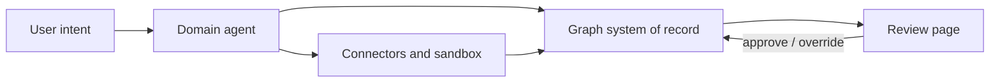

# SSOTA

**Infrastructure for SaaS 2.0: Specialist + System of record.**

Classic SaaS fuses three things in one product: the **lists** (what happened),
the **playbook** (how work gets done), and the **UI** a human operates every
day. The human is the specialist — moving records, following stages, applying
judgment in the gaps the product allows.

The next step is not a better opinionated UI. It is **agents** doing that
specialist work. That only works if the product **unbundles** into layers: a
**system of record** agents read and write, **domain agents** with your team's
playbooks, and **review pages** where humans approve outcomes — not operate every
field. SSOTA implements the record as a **typed graph** and ships the workspace
to configure agents and pages on that structure.

> Specialists do the work. The graph remembers. Pages are for approval.

## The shift

Most enterprise SaaS is built from the same parts: **lists** — accounts,
opportunities, activities — plus a **playbook** baked into stages, required
fields, and defaults. A human operates the UI and acts as the specialist.

**Agents** are the scalable replacement for that operator. They need a machine-
readable **system of record**, explicit **playbooks**, and a place for humans to
**review** — not another monolithic screen where a person still does the work.

SaaS 2.0 unbundles the stack:

| SaaS 1.0 | SaaS 2.0 |
| --- | --- |
| Lists + playbook + UI in one product | System of record + specialist + review surface as layers |
| Human operates the UI | Agent operates the record |
| Playbook fixed by vendor | Playbook configurable per team |
| UI is where work happens | UI is where work is reviewed and approved |

SSOTA is infrastructure for that model.

## The SSOTA model

| Layer | SaaS 2.0 role | SSOTA |
| --- | --- | --- |
| System of record | What actually happened | Typed graph (nodes, edges, catalog) |
| Specialist | Judgment + execution | Domain agents (instructions, skills, tools) |
| Surface | Trust + oversight | JSON-render review pages (approve, override, audit) |

SSOTA solves the product problem with two editable runtimes:

1. **Agent runtime configuration** — the team-facing control plane for specialists.
2. **Context runtime configuration** — the graph-shaped system of record agents
   use as shared work context, and humans experience through dynamic pages.

The user-visible result is a domain workspace: a roadmap, hiring pipeline,
customer operations console, legal review workspace, or software delivery hub
that feels purpose-built, while agents operate on structured context behind it.

## Why a graph, not a spreadsheet

The Specialist + system of record model is easy to picture as rows and columns —
the spreadsheet metaphor from SaaS 1.0. CRM, ATS, and ops tools *feel* like
spreadsheets with opinions baked in.

That metaphor is directionally right, but it breaks down once agents become the
primary operator.

### Real work is relational, not tabular

A hiring pipeline is not one list. It is candidates, roles, interviews,
feedback, offers, and blockers — linked to each other. A product delivery
workspace is requirements, tasks, artifacts, decisions, and dependencies.

Agents do not only "update a row." They traverse relationships: what blocked
this task, which decision changed this scope, what artifact proves this claim. A
graph models that directly. A spreadsheet models it with hidden foreign keys
and team convention.

### Vertical domains do not fit one table shape

Every vertical has different object types and rules. Sales has accounts and
opportunities. Engineering has initiatives and PRs. Legal has matters and
clauses.

SSOTA uses typed catalogs (node types, edge types) so each template can define
its own domain model without rebuilding a database and UI from scratch every
time. The graph is a spreadsheet that can grow new lists and links, not a
single grid.

### Playbooks need context, not just cells

A specialist follows a playbook: qualify this lead, unblock this task, prepare
this review. Playbooks depend on neighborhood context — what is connected, what
changed, what is stale.

Graphs give agents queryable work context. Spreadsheets give them cells.
Agents work better when the system of record matches how work is actually
connected.

### Humans still need auditability

Even when users stop doing data entry, they still ask: *did this actually
happen?* *who approved it?* *what was the state before?*

A graph-shaped system of record keeps structured history across linked objects.
Review pages surface that record in familiar SaaS shapes — tables, boards,
documents — without forcing humans to operate the raw structure.

### The SSOTA choice

SSOTA keeps the spreadsheet mental model — lists, records, system of truth — but
implements it as a typed graph:

- **Nodes** — domain objects (the lists)
- **Edges** — relationships and process links
- **Catalog** — schema per vertical template
- **Pages** — human-readable views over the same record

**The graph is the spreadsheet, unfolded.** Specialists operate on the graph.
Humans approve on pages.

## How work runs

1. A user states intent — in chat, a trigger, or a schedule.
2. A domain agent applies the playbook — reads the graph, calls tools, updates
   records, creates tasks.
3. A human reviews the outcome on a page — approves, rejects, or corrects
   exceptions.
4. The graph remains the system of record — pages reflect it, agents write it.



## Why SSOTA exists

[Vercel Eve](https://vercel.com/eve) introduced a useful shape for agents:
instructions, tools, skills, connections, schedules, channels, subagents, and a
sandbox live together as one deployable agent project.

That is the right runtime shape. But it is still code.

Once a team operates more than one agent, two problems show up.

### 1. Agent runtime is not a team workspace

Teams need to understand and change the agent system without reading every file
or redeploying every iteration:

- which agents exist
- what instructions they follow
- what triggers, channels, and schedules start them
- which tools, skills, connectors, subagents, and sandboxes they can use
- what model, approval policy, and run policy they use

### 2. Agents need a shared system of record

Agents also need one workspace context to act inside. SSOTA models that context
as a typed graph because agent work is relational: requirements connect to
tasks, tasks connect to artifacts, artifacts connect to decisions, and external
service data needs to be linked back to the same source of truth.

- domain objects and relationships
- graph scopes that define what each agent can read or write
- tasks, chat sessions, artifacts, and work history
- connected data pulled from external services through connectors
- pages that let humans review and approve the same system

Without that shared system of record, agent work fragments across tools, chats,
files, and external services.

## Agent runtime configuration

SSOTA turns Eve-shaped runtime code into workspace objects:

| Eve-shaped element | SSOTA workspace object |
| --- | --- |
| `instructions.md` | Agent instructions editable in the workspace |
| `agent.ts` | Model, trigger, run policy, sandbox policy |
| `tools/` | Allowed tool bundles and script tools |
| `skills/` | Bound skill catalog and on-demand playbooks |
| `connections/` | Connector accounts and provider permissions |
| `channels/` | Chat, API, bot, and workflow entry points |
| `schedules/` | Workspace schedules and heartbeat fan-out |
| `sandbox/` | Sandbox environments, sources, sessions, snapshots |
| `subagents/` | Agent definitions and task delegation |
| Deployable app | Teamspace template and runtime |

This makes agent systems easier to operate after they exist. A team can change
agent definitions, permissions, and runtime policy without treating every
product iteration as a new agent deployment.

## Context runtime configuration

The graph is the shared system of record underneath the agents. It is not the
UI.

Most SaaS products do not show users raw database tables, even when tables are
the system of record. They translate records into domain-specific screens:
pipelines, roadmaps, candidate funnels, project plans, support queues, and
dashboards.

SSOTA applies the same idea to graph-backed agent workspaces:

- **Graph for agents** — typed nodes and edges store domain context in a form
  LLMs can query, traverse, and update.
- **Pages for humans** — dynamic JSON-render pages turn the graph into familiar
  SaaS surfaces: tables, documents, boards, workbenches, and dashboards — focused
  on review, approval, and exception handling.
- **Templates for teams** — a template installs the whole vertical product:
  data model, agent runtime, human UI layer, skills, schedules, and sandbox
  policy for a workflow.

The goal is not to make humans operate a graph. The goal is to give agents a
graph-shaped system of record, then render that record as product-grade review
surfaces people can trust.

Think of it as an LLM Wiki made operational: structured enough for agents,
legible enough for teams, and editable as a workspace.

## Product model

SSOTA has four layers.

| Layer | Agent-facing form | Human-facing form |
| --- | --- | --- |
| Runtime definition | Agents, subagents, skills, tools, connectors, channels, schedules, sandboxes | Workspace settings and templates |
| Context definition | Node catalog, edge catalog, graph scopes | Page definitions and page templates |
| Agent runtime | Tasks, chat sessions, agent runs | Task board, chat UI, run history |
| Context runtime | Node instances, edge instances | Dynamic pages, tables, documents, dashboards |

## What is in a workspace

### Agents

Agents are runtime definitions: instructions, allowed triggers, tool bundles,
model policy, sandbox access, connector providers, channels, subagents, and
graph scope.

They can be main conversational agents, specialist task agents, scheduled
workers, or reference-only guides.

### Skills

Skills are reusable procedures and domain playbooks. They stay outside the
always-on prompt and are loaded only when relevant.

### Connectors

Connectors give agents scoped access to external systems such as GitHub, Slack,
Linear, Notion, Stripe, or internal APIs.

### Schedules

Schedules start recurring work. They can trigger a main-agent heartbeat, spawn a
new agent task, or dispatch ready tasks.

### Sandboxes

Sandboxes are isolated work environments for code execution, repository work,
preview apps, and generated artifacts.

### Pages

Pages are dynamic views over the graph. A page defines a JSON-render component
tree, data bindings, and server-authoritative actions.

Agents write the graph. Humans review outcomes on pages.

### Templates

Templates package a complete domain workspace: graph catalog, runtime
definitions, page tree, human UI layer, and workflow defaults.

The built-in software development template includes roadmap, research,
initiatives, design, engineering, build, QA, launch, and retrospective surfaces.

## For builders

SSOTA is for teams building **domain workspaces** — not another opinionated
SaaS SKU:

- **Declare the domain model** — node and edge catalogs per template
- **Configure specialists** — agent instructions, skills, tools, connectors,
  schedules, and approval policy in the workspace
- **Ship review surfaces** — JSON-render pages with bindings and actions, not
  bespoke React screens per workflow
- **Install a template** — graph schema, agents, and pages as one vertical pack

The active product is a development-workflow workspace. The generic action
runtime from earlier experiments is archived as reference material only.

## Build your own pack from your coding agent

> **AX (Agent Transformation)** — point Claude Code, Cursor, or Codex at SSOTA
> over MCP and have it author your domain's operating environment: the graph
> catalog, review pages, agents, and schedules. A **pack** is that environment,
> made repeatable.

You don't assemble a SSOTA workspace by hand. You connect the coding agent you
already use to the **SSOTA MCP**, load the **AX authoring skill**, and describe
your domain in a sentence. The agent authors the four layers bottom-up and you
review the result as pages in the workspace. Real records come later — created
by your team or the environment's own agents on top of the catalog.

| Layer | Authored with | Example (HR) |
| --- | --- | --- |
| **Catalog** — node & edge types | `create_node_type`, `create_edge_type` | `employee`, `leave_request`, `approved_by` |
| **Pages** — json-render review surfaces | `list_page_components` → `create_page` | pending-leave inbox + approve action, team calendar |
| **Agents** — specialists + orchestrator | `create_agent` | intake agent + an orchestrator that dispatches work |
| **Schedules** — cron cadence | `create_schedule` | 09:00 daily run so the environment runs itself |

### 1 · Connect the SSOTA MCP

Every tool lives on one endpoint, **`/api/mcp`**; scope (`orgSlug` +
`teamspaceSlug`) is passed as tool params on each call and validated
server-side.

| | SSOTA cloud / hosted | Local (self-host or `pnpm dev`) |
| --- | --- | --- |
| URL | `https://mcp.ssota.ai/api/mcp` (or `https://<your-host>/api/mcp`) | `http://127.0.0.1:3001/api/mcp` |
| Auth | OAuth — the client handles it | `Authorization: Bearer <token>` |

**Claude Code**

```bash
# hosted — OAuth runs interactively on first use
claude mcp add --transport http ssota https://mcp.ssota.ai/api/mcp

# local — bearer token
claude mcp add --transport http ssota-local http://127.0.0.1:3001/api/mcp \
  --header "Authorization: Bearer $SSOTA_MCP_TOKEN"
```

**Cursor** — add to `.cursor/mcp.json` (project) or `~/.cursor/mcp.json` (global):

```json
{
  "mcpServers": {
    "ssota": { "url": "https://mcp.ssota.ai/api/mcp" }
  }
}
```

Hosted: omit `headers` — Cursor manages OAuth. Local: use the `127.0.0.1:3001`
URL with `"headers": { "Authorization": "Bearer ${SSOTA_MCP_TOKEN}" }`.

**Codex** — add an MCP server to `~/.codex/config.toml`:

```toml
[mcp_servers.ssota]
url = "https://mcp.ssota.ai/api/mcp"
```

For stdio-only setups, bridge with `npx mcp-remote https://mcp.ssota.ai/api/mcp`.

The repo ships a ready-made bundle at [`plugins/ssota-plugin/`](plugins/ssota-plugin/)
(MCP config + skills) with per-client walkthroughs in
[`plugins/ssota-plugin/examples/`](plugins/ssota-plugin/examples/).

### 2 · Load the AX skill

Two skills work together: **`ssota-mcp`** (connect + resolve scope) and
**`ssota-ax-author`** (author the environment). They live in `.agents/skills/`
with Claude and Cursor mirrors, and inside the plugin bundle. Install the
plugin, or symlink the skill into your client's skills directory:

```bash
ln -s "$PWD/.agents/skills/ssota-ax-author" .claude/skills/ssota-ax-author
```

### 3 · Describe your domain

```txt
Use the ssota-ax-author skill. Set up our HR attendance & leave system in SSOTA
(org: acme, teamspace: people-ops).
```

The agent discovers your scope (`list_projects`), reuses any existing types
(`search_catalog`), then authors catalog → pages → agents → schedules — running
a self-review before each `create_page` so what ships is valid and legible, not
a form dump.

### 4 · Review it in the workspace

Open the teamspace: the pages render as real review surfaces (inbox, calendar,
dashboard), the schedule appears in the cadence, and the graph is ready for
instances. Re-run the same prompt to refine — upserts are idempotent by key —
or capture the environment as a reusable template.

Full authoring contract:
[`.agents/skills/ssota-ax-author/SKILL.md`](.agents/skills/ssota-ax-author/SKILL.md).

## Architecture

SSOTA is built as a multi-tenant workspace on top of:

- Next.js 16 for the web app
- Vercel AI Gateway for model routing
- Vercel Workflow SDK for durable agent execution
- Vercel Chat SDK patterns for chat and bot surfaces
- Vercel Connect-style scoped credentials for external systems
- Vercel Sandbox for isolated work environments
- Postgres and Drizzle for graph, page, task, chat, and runtime state
- Zod contracts for typed boundaries
- JSON-render pages for dynamic human-facing surfaces
- Composio-backed connectors for external tool access

SSOTA is Vercel-native by default. Local development can still attach to a
developer's own Postgres, Supabase, connector credentials, and sandbox-like
environment for iteration.

## Influences

- [SaaS 2.0 — from Software-as-a-Service to Specialist-and-a-Spreadsheet](https://benn.substack.com/p/saas-2-specialist-and-a-spreadsheet)
  — lists plus embedded playbooks, and the shift toward agent-operated records
- [Vercel Eve](https://vercel.com/eve) — deployable agent runtime shape
  (instructions, tools, skills, connections, sandbox)

SSOTA adopts the Specialist + system of record model and implements the record
as a typed graph so agents can traverse relational work context across vertical
domains.

## Local development

Local machine:

```bash
nvm use
pnpm install
supabase start
pnpm db:migrate
pnpm db:seed
pnpm dev
```

Cursor Cloud:

```bash
nvm use
pnpm cloud:prepare
pnpm dev
```

Useful checks:

```bash
pnpm lint
pnpm typecheck
pnpm test --filter @ssota/core
pnpm e2e:ci
```

## License

SSOTA is **fair-code** distributed software — source-available, but **not**
OSI-approved open source.

- Everything **except** files containing `.ee.` in their name and content under
  `ee/` directories is licensed under the **Sustainable Use License**
  ([LICENSE.md](LICENSE.md)). You may self-host and modify it for your own
  internal business purposes or non-commercial use, and redistribute it free of
  charge for non-commercial purposes.
- You may not offer SSOTA as a paid managed hosting service for third-party
  customers, including monthly or usage-based hosted instances, without a
  separate commercial agreement.
- Files containing `.ee.` and content under `ee/` directories are licensed under
  the **SSOTA Enterprise License** ([LICENSE_EE.md](LICENSE_EE.md)) and require a
  valid commercial agreement.
