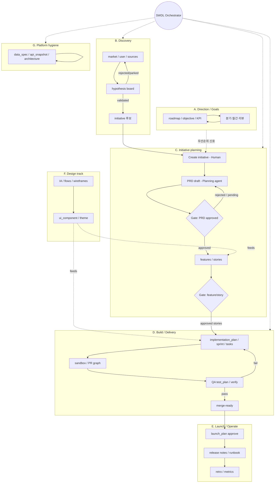

# SWDL 운영 모델 — 게이트·사이클·페이지 갭

> 상태: design discussion · 2026-07-09  
> 범위: Domain Pack 운영 가정, **게이트 정책 선언** 설계, 사람 승인 모델, 미연동 페이지 개선, 업무 사이클 맵.  
> 전제: Main = 플랫폼 챗봇(루프 밖). SWDL cadence = Orchestrator only.  
> 관련: [swdl-seed-upgrade-analysis.md](swdl-seed-upgrade-analysis.md) · [swdl-runtime-skills.md](swdl-runtime-skills.md) · AGENTS.md `[GRAPH-05]` · `[ARCH-03]`

---

## 0. 한 줄 결론

SWDL은 **하나의 선형 SDLC가 아니라 겹치는 업무 사이클**이다.  
에이전트 루프를 “승인만으로” 돌리려면 **도메인 특화 `if (delivery && prd.approved)`를 코어에 박지 말고**, edge domain/range처럼 **팩이 선언하고 엔진이 평가하는 게이트 정책**이 필요하다.  
사람 쪽은 **ApprovalInbox(산출물 상태)** 와 **Human task(판단 일)** 를 나눈다.

---

## 1. 게이트 정책 선언 — 설계 논의

### 1.1 왜 코드 하드코딩이 안 되는가

잘못된 예:

```ts
// ❌ packages/core 또는 adapter에 SWDL 타입을 박음
if (role === "delivery") {
  const prd = await findPrd(initiativeId);
  if (prd?.properties.status !== "approved") {
    throw new DomainError("GATE_PENDING", "PRD not approved");
  }
}
```

문제:

- `prd` / `approved` / Delivery 역할은 **org·Domain Pack 데이터**다.
- HR·재무·다른 팩은 같은 코어를 쓰며 스키마가 다르다.
- `[ARCH-03]` — 과거 generic Gate 런타임을 제품에 복원하지 않는다. 그렇다고 **도메인 분기를 코어에 심는 것**도 금지에 가깝다.

올바른 분리:

| 층 | 소유 | 내용 |
|----|------|------|
| **정책 내용** | Domain Pack (contracts seed / catalog row) | “무엇을 막을지” — catalogKey, property path, allowed values, 관계 탐색 |
| **평가 엔진** | `packages/core` (제네릭) | “선언된 정책을 mutation/spawn 전에 평가” — SWDL 문자열 없음 |
| **UI** | pages-tree (`ApprovalInbox` 등) | 사람이 정책이 읽는 필드를 바꿈 |
| **안내** | agent skills / instructions | 왜 막혔는지·다음에 뭘 할지 (강제력 없음) |

이미 같은 패턴이 있다: **edge `domainKeys`/`rangeKeys` → GRAPH-05 평가**. 게이트는 그 연장이다.

### 1.2 게이트가 막는 표면 (when)

엔진이 정책을 걸 수 있는 **제네릭 훅**만 코드에 둔다.

| Hook (가칭) | 트리거 | 예 (SWDL 팩이 선언) |
|-------------|--------|---------------------|
| `before_create_node` | `create_node` | `task` 생성 시 initiative 스코프의 `prd.status ∈ {approved}` |
| `before_update_node` | `update_node` / `set_node_property` | `feature.status`를 `in_progress`로 올리려면 선행 `approved` |
| `before_create_edge` | `create_edge` | (대부분 GRAPH-05로 충분; 게이트는 부가 조건) |
| `before_spawn_task` | `spawn_task` | specialist `agentDefinitionId` 또는 태그로 Delivery 스폰 시 동일 조건 |
| `before_complete_task` | work-order 완료 | (선택) handoff에 필수 nodeIds |

**spawn 게이트**와 **graph write 게이트**를 둘 다 두는 이유:  
에이전트가 spawn을 우회해 `create_node(task)`만 해도 막혀야 하고, Orchestrator가 조건 없이 Delivery를 스폰해도 막혀야 한다.

### 1.3 선언 스키마 (초안)

팩/카탈로그에 붙는 **데이터** 형태. 이름은 가칭 `GatePolicy` — 구현 시 Zod는 `packages/contracts`에만.

```ts
// 개념 스케치 — 아직 코드 SSOT 아님
type GatePolicy = {
  id: string;                    // pack-local id, e.g. "swdl.prd-before-task"
  when: GateHook;                // before_create_node | before_spawn_task | ...
  /** 이 mutation의 대상이 매칭될 때만 평가 */
  match: {
    catalogKey?: string;         // create_node/update의 대상 타입
    agentDefinitionId?: string;  // spawn 대상 에이전트 (또는 agentTag)
    property?: { path: string; in?: string[]; notIn?: string[] }; // update 시
  };
  /** 모두 만족해야 pass (AND). 실패 시 GATE_PENDING */
  require: GateRequirement[];
  onFail: {
    code: "GATE_PENDING" | "GATE_REJECTED";
    messageTemplate?: string;    // "{{missing}} not approved"
    /** UI/에이전트 힌트 — 강제 아님 */
    suggest?: {
      approvalCatalogKey?: string;
      pageKey?: string;          // e.g. "tpl/initiative/planning/prd"
      spawnHumanTask?: boolean;
    };
  };
};

type GateRequirement =
  | {
      kind: "related_node_property";
      /** 대상 노드에서 관계로 도달 */
      via: {
        edgeCatalogKey: string;  // e.g. for_initiative
        direction: "out" | "in";
        /** 한 홉 더: initiative → prd */
        then?: { edgeCatalogKey: string; direction: "in" | "out"; catalogKey: string };
        catalogKey: string;      // 최종 노드 타입
      };
      path: string;              // properties.status
      in: string[];              // ["approved"]
      /** 관련 노드 0개일 때: fail | pass */
      ifMissing: "fail" | "pass";
    }
  | {
      kind: "self_property";
      path: string;
      in?: string[];
      notIn?: string[];
    }
  | {
      kind: "count_related";
      via: { edgeCatalogKey: string; direction: "out" | "in"; catalogKey: string };
      min?: number;
      max?: number;
    };
```

SWDL 예시 (팩 JSON에만 존재):

```json
{
  "id": "swdl.prd-approved-before-task",
  "when": "before_create_node",
  "match": { "catalogKey": "task" },
  "require": [
    {
      "kind": "related_node_property",
      "via": {
        "edgeCatalogKey": "for_initiative",
        "direction": "out",
        "catalogKey": "initiative",
        "then": {
          "edgeCatalogKey": "for_initiative",
          "direction": "in",
          "catalogKey": "prd"
        }
      },
      "path": "status",
      "in": ["approved"],
      "ifMissing": "fail"
    }
  ],
  "onFail": {
    "code": "GATE_PENDING",
    "suggest": {
      "approvalCatalogKey": "prd",
      "pageKey": "tpl/initiative/planning/prd",
      "spawnHumanTask": false
    }
  }
}
```

같은 조건을 `before_spawn_task` + `match.agentDefinitionId = <Delivery>` 로 한 장 더 두면 spawn도 막는다.  
**코어에는 `prd`/`delivery` 문자열이 없다.**

### 1.4 저장 위치 (선택지)

| 옵션 | 장점 | 단점 | 추천 |
|------|------|------|------|
| **A. seed-pack `gate-policies.json` + org 시드 테이블** | 페이지/엣지와 같은 팩 단위, 버전 관리 쉬움 | 새 테이블·시드 경로 | **1순위** |
| **B. `node_catalog.metadata.gates` / edge metadata** | 타입 옆에 붙음 | “task 생성 시 prd 조건”처럼 **다른 타입을 가리키는** 정책이 어색 | 타입-로컬 전이만 |
| **C. page actions에만** | UI와 밀착 | 에이전트 MCP write가 우회 | 부족 |
| **D. 레거시 workflow.gates 복원** | 기존 스키마 흔적 | `[ARCH-03]` 충돌, Action/Gate 런타임 복원 유혹 | **비범위** |

권장: **A**를 Domain Pack 아티팩트로 두고, 시드 시 org/teamspace에 적재.  
평가기는 `createGraphPorts` / `spawn_task` use-case가 **CatalogRead + GatePolicyPort**를 읽는다.

### 1.5 평가 의미론

- **Fail closed for `required` policies** matching the hook+match.  
- 여러 정책이 매칭되면 **모두** 통과 (AND across policies).  
- `ifMissing: fail` — 관계 그래프가 아직 없으면 생성 자체를 막아 “먼저 PRD·링크”를 강제.  
- 에러 코드 `GATE_PENDING` — 에이전트는 `blocked` + suggest.pageKey / Human task 여부.  
- **soft 모드(선택, 후순위):** 로그만 — 팩 도입 초기 dogfood용. 기본은 hard.

상태 enum 자체는 계속 **propertySchema(Zod/JSON Schema)** 가 SSOT.  
게이트는 “어느 값이 통과인가”만 참조하고, enum을 중복 정의하지 않는다.

### 1.6 사람 승인과의 연결

```
[Agent] create_node(task) or spawn(Delivery)
    → GatePolicy evaluator (data)
    → GATE_PENDING
[Human] ApprovalInbox on prd (status draft|review → approved)
    → set_node_property (일반 graph write; 게이트는 "approved로 가는 전이"만 선택적 검증)
[Orchestrator cron 또는 approve 후속 액션]
    → spawn 재시도 / 통과
```

**승인 UI는 정책을 실행하지 않는다.** 정책이 읽는 필드를 바꿀 뿐이다.  
Approve 직후 즉시 다음 단계가 필요하면 page action에 **제네릭** `spawn_task` / `enqueue_orchestrator_signal`을 붙일 수 있다(역시 팩이 대상 agent id를 데이터로 넣음).

### 1.7 Human task vs ApprovalInbox (재확인)

| | Human `tasks` (`executorType=Human`) | 그래프 노드 + `ApprovalInbox` |
|--|--------------------------------------|-------------------------------|
| 의미 | 사람에게 할당된 **작업** | 산출물의 **상태 게이트** |
| 완료 | task `done` | `properties.status = approved` 등 |
| 엔진 연동 | spawn 분배·Tasks UI | GatePolicy `require`가 읽는 필드 |
| 쓸 때 | 모호한 판단, 조사, 블로커 해소 | PRD/Feature/Launch 등 명시적 승인 |

규칙: **분배는 tasks로, 게이트 상태는 노드로, Inbox는 노드 UI.**  
게이트 fail 시 `suggest.spawnHumanTask: true`면 Orchestrator/에이전트가 Human task를 **추가로** 만들 수 있다(상태 대체 아님).

### 1.8 비범위 / 함정

- 코어에 SWDL catalogKey 리터럴 금지.  
- `[ARCH-03]` Action Log + Human Gate 트랜잭션 모델 복원 금지.  
- Instruction-only “승인 기다려”는 게이트가 아님.  
- 모든 페이지 전이를 게이트로 만들지 말 것 — **사이클 경계**(기획→빌드, 빌드→런치 등)만.  
- Design/Executive 등 루프 밖 사이클은 별도 정책 묶음 또는 게이트 없음(Human-led).

### 1.9 구현 슬라이스 (제안)

1. **contracts:** `GatePolicy` Zod + seed-pack `gate-policies.json` (SWDL 2~3개만: prd→task, feature approved→story ready, 선택적 launch).  
2. **core:** `evaluateGatePolicies(hook, ctx)` + create-node / spawn-task 연동 + `GATE_PENDING` 거부 테스트 `[TEST-01]`.  
3. **pages:** planning ApprovalInbox 슬라이스.  
4. **skills:** orchestrate/routing이 “게이트 실패 = skip + 요약”으로 정렬 (하드코딩 타입 나열 최소화, 정책 id 참조).

---

## 2. 미연동 노드·빈약 페이지 개선 계획

### 2.1 Specialist primary 밖 타입 (페이지는 있으나 루프 약함)

| 클러스터 | 타입 | 개선 |
|----------|------|------|
| Executive | product_roadmap, roadmap, objective, key_result, kpi | **Goals 사이클** — Orchestrator 일상 스캔 밖 또는 주간만 |
| Design | information_architecture, page_wireframe, user_flow, ui_component, design_theme, design_toolchain | Design specialist 또는 Human-led + draft agent |
| Architecture evergreen | architecture_spec, data_spec, integration_spec, api_reference, api_snapshot | **Hygiene 사이클** + 주간 신호 |
| Launch / Retro | launch_plan, release_note, runbook, retrospective, metric_snapshot | Release 사이클 + 승인 Inbox |
| 고아/레거시 | `page`, `agent` 노드 | deprecate 또는 lab-only |

### 2.2 페이지 빈약

- L0 `PageHeader`만: executive / research / manager / development / design + initiative 섹션 허브 → StatRow·게이트 카운트·CTA.  
- Planning features/stories: ApprovalInbox 탭.  
- overview / wireframes: actions·게이트 요약.  
- ui-components: Design 사이클에만 명시적 소유.

### 2.3 PR 순서 (게이트와 맞춤)

1. GatePolicy 스키마 + evaluator + SWDL 최소 정책  
2. ApprovalInbox 페이지 + Human task 규칙 문서화  
3. Design/Launch 소유권  
4. Hygiene 주간 신호  
5. 허브 보강  

---

## 3. 서브그룹 · 트리거 · 루프

Main은 이 다이어그램 **밖**(플랫폼 채팅). Orchestrator cron이 B/C/D/G를 주로 스캔한다.



### 그룹별 시작 트리거 / 루프 / 끝

| 그룹 | 시작 트리거 | 루프 | 끝나는 곳 |
|------|-------------|------|-----------|
| A Goals | 분기 기획, 주간 KPI | 측정→판단→목표 수정 | 목표 체계 (배포 필수 아님) |
| B Discovery | 가설/리서치 공백, Orchestrator | draft→testing→validated/rejected | validated 또는 parked |
| C Planning | Human initiative 생성 | draft→**게이트**→stories | stories/features approved |
| D Build | 게이트 통과, backlog 신호 | task↔PR↔QA | merge-ready |
| E Launch | D pass | launch 승인→문서→retro | retro 닫힘 |
| F Design | 기획/빌드 중 UX 필요 | 초안↔리뷰 | 스펙에 흡수 |
| G Hygiene | 주간 cron, API 변경 | diff→문서 갱신 | evergreen 최신 |

게이트 정책은 특히 **C→D**, **D→E** 경계에 둔다. A/F/G는 별 사이클(직렬 강제 최소화).

---

## 4. 소프트웨어 팀에서 자주 도는 업무 사이클 (확장 목록)

### 방향·우선순위
1. OKR/KPI 주간 리뷰  
2. 로드맵 분기 재배치  
3. 이니셔티브 포트폴리오 트리아지  
4. 용량/스프린트 커밋 계획  

### 발견·문제정의
5. 시장/경쟁 스캔  
6. 유저 인터뷰 합성  
7. 가설 실험·검증  
8. 지원/세일즈 이슈 → 문제 백로그  
9. 분석 이벤트·퍼널 점검  

### 기획·스펙
10. PRD 작성·승인  
11. Feature/Story 분해·추정  
12. 수락 기준(AC) 합의  
13. 의존성/리스크 레지스터  
14. 프라이버시/보안 리뷰 게이트  

### 디자인
15. IA/플로우 합의  
16. 와이어→하이파이  
17. 디자인 시스템/토큰 동기화  
18. 접근성 리뷰  
19. 카피/마이크로카피 리뷰  

### 엔지니어링 실행
20. 테크 스파이크  
21. 구현 플랜·태스크 브레이크다운  
22. 스프린트 실행·보드  
23. PR·코드리뷰·CI  
24. 버그 트리아지·핫픽스  
25. 기술부채/리팩터 배치  
26. 성능/비용 최적화  
27. 피처 플래그 롤아웃  

### 품질
28. 테스트 플랜·케이스 갱신  
29. 회귀/스모크  
30. 탐색적 QA  
31. 보안/펜테스트 후속  
32. 장애 사후 → 액션 아이템  

### 데이터·API·플랫폼
33. API/데이터 모델 파악·스키마 최신화  
34. api_snapshot 계약 드리프트 감지  
35. 마이그레이션 리허설  
36. 관측성(대시보드/알림) 정비  
37. 시크릿/권한/RLS 감사  

### 릴리스·운영
38. 릴리스 열차/컷 기준  
39. 런북·온콜 핸드북  
40. 배포 후 공식 문서/changelog 업데이트  
41. 고객 공지·마이그레이션 가이드  
42. 피처 채택 측정 → 킬/유지  

### 협업·에이전트 운영 (SSOTA)
43. Orchestrator 스윕  
44. Human 승인 큐 / ApprovalInbox 소진  
45. 에이전트 스킬·instruction 드리프트 교정  
46. 커넥터 동기 건강  
47. 샌드박스/워커 실패 복구  

### 조직·컴플라이언스
48. 라이선스/의존성 감사  
49. 감사 로그·접근 리뷰  
50. 온보딩 체크리스트(멤버/에이전트)  

---

## 5. 현재 Domain Pack과의 거리

| 항목 | 지금 | 게이트 선언 이후 |
|------|------|------------------|
| C→D 강제 | instruction/스킬 힌트만 | `gate-policies.json` + evaluator |
| 승인 UI | 셀/문서 편집, ApprovalInbox 미시드 | planning ApprovalInbox |
| Human 분배 | 가능하나 SWDL 루프에 미정착 | fail suggest + Orchestrator 규칙 |
| A/F/E/G | 페이지 있음, 루프 약함 | 사이클별 트리거·소유권 (§2–3) |
| Main | 루프 밖 챗봇 | 변경 없음 |

---

## 6. 다음 토론 포인트

1. `via.then` 홉 수를 2로 고정할지, path expression으로 일반화할지.  
2. `before_spawn_task` match를 agentDefinitionId 대신 **agent tag / role label**(팩 메타)로 할지.  
3. 승인 직후 동기 spawn vs 다음 cron만 — UX vs 단순성.  
4. GatePolicy를 org-scoped catalog로 둘지 teamspace overlay를 허용할지 (`[GRAPH-03]`와 정합).
