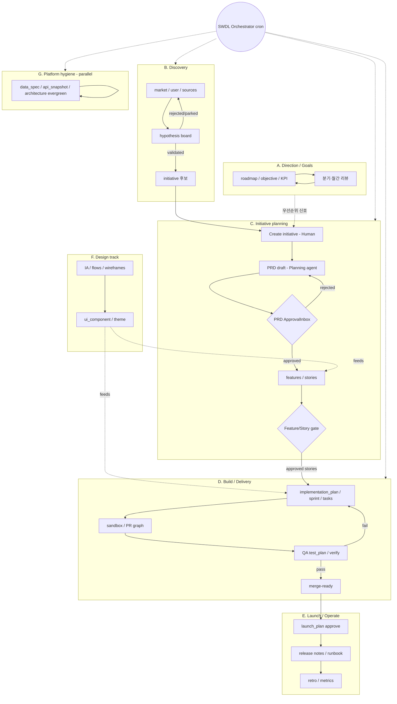

# SWDL 업무 사이클 · 서브그룹 · 트리거

> 상태: analysis + implementation · 2026-07-09  
> 목적: SWDL Domain Pack을 **하나의 선형 SDLC**가 아니라 **겹치는 업무 사이클**로 이해하고, 그룹별 시작 트리거·루프·종료 조건과 소프트웨어 팀에서 자주 도는 사이클 목록을 고정한다.  
> 관련: [swdl-operating-model.md](swdl-operating-model.md) (게이트 정책·승인·페이지 갭) · [swdl-seed-upgrade-analysis.md](swdl-seed-upgrade-analysis.md) · [swdl-runtime-skills.md](swdl-runtime-skills.md)  
> Orchestrator = Domain Pack cadence (Main 챗봇과 무관)

---

## Code SSOT (WorkCycle A–G)

> Implementation reference — seeds + Console UI.

- **Seeds:** `packages/contracts/seed-packs/software-development-workflow/work-cycles.json`  
- **L1 types:** `work_cycle` · `gate_policy`  
- **Console:** `/{orgSlug}/work-cycle` (React Flow Sub Flow map)  
- **Gates:** `gate_policy` instances + core `evaluateGatePolicies` (path expressions)

WorkCycles are an **operating map** for the software-development domain. They are **not** the orchestrator execution SSOT — agents/schedules/`spawn_task` run work; GatePolicy enforces boundaries and can sync-spawn on approval.

### Groups

| Letter | `group` | Focus |
|---|---|---|
| A | `direction` | Goals / direction |
| B | `discovery` | Research / discovery |
| C | `planning` | Initiative planning (PRD) |
| D | `delivery` | Build / delivery |
| E | `launch` | Launch / operate |
| F | `design` | Design track |
| G | `hygiene` | Platform hygiene |

Each instance has `cycleKey`, `topology` (`trigger` / `stage` / `gate` / `end` + edges), optional `handoffToCycleKeys`, and `includedTeamspaceIds: []` (all teamspaces).

Gate topology nodes carry `gatePolicyKey` → `gate_policy.properties.policyKey`. The `/work-cycle` UI joins policy require summaries onto those nodes.

### Minimal GatePolicy set (Planning → Delivery)

Seed: `gate-policies.json`

1. `swdl.prd-approved-before-task` — `before_create_node` match `task`
2. `swdl.prd-approved-before-delivery-spawn` — `before_spawn_task` match Delivery `agentDefinitionId`
3. `swdl.prd-approved-onpass-spawn` — update PRD → approved → `onPass` Delivery spawn (idempotent)
4. (optional) feature/story approved gate

Path expressions use catalog keys only (e.g. `in:for_initiative[prd].status`). Core never hard-codes SWDL literals.

### Authoring

AX skill Step 0 / 0b: `.agents/skills/ssota-ax-author/references/work-cycle-authoring.md` and `gate-policy-authoring.md`.

---

## 0. 한 줄 전제

- **Main** = 플랫폼 챗봇 (루프 밖).  
- **SWDL Orchestrator** = Research→Planning→Delivery→QA(+ hygiene) 스윕용 cadence.  
- 목표(OKR)·디자인·런치·evergreen은 Delivery와 **직렬로 끝까지 연결되지 않는다**. 각각 시작·루프·끝이 있다.

---

## 1. 서브그룹 다이어그램



### 읽기 가이드

| 화살표 | 의미 |
|--------|------|
| 실선 | 같은 사이클 안 상태 전이 |
| 점선 `-.->` | 약한 신호·피드 (필수 직렬 아님) |
| `ORCH` | 스케줄 스윕이 **주로** 건드리는 그룹 |

---

## 2. 그룹별 시작 트리거 / 루프 / 끝

| 그룹 | 이름 | 시작 트리거 | 루프 | 보통 끝나는 곳 | Orchestrator |
|------|------|-------------|------|----------------|--------------|
| **A** | Direction / Goals | 분기 기획, 주간 KPI 리뷰, 로드맵 재배치 | 측정 → 판단 → 목표/로드맵 수정 | **목표 체계** (코드 배포 필수 아님) | 비범위 또는 주간 신호만 |
| **B** | Discovery | 가설/리서치 공백, 시장 변화, Orchestrator research spawn | draft → testing → validated / rejected / parked | validated(이니셔티브 후보) 또는 parked | **스캔함** |
| **C** | Initiative planning | **Human**이 initiative 생성; Discovery validated | PRD/feature/story 초안 → **승인 게이트** → 재작성 | stories/features **approved** | **스캔함** (게이트 후 Delivery로) |
| **D** | Build / Delivery | stories approved, backlog 얇음, stale `in_progress` | task ↔ PR ↔ QA fail/pass | merge-ready / graph tasks `done` | **스캔함** |
| **E** | Launch / Operate | D pass, 릴리스 컷 | launch 승인 → 문서/런북 → retro | retro·메트릭 닫힘 | 약함 (Human·별도 트리거 자연) |
| **F** | Design track | 기획/빌드 중 UX 필요 | IA/플로우/와이어 ↔ 리뷰 ↔ DS 동기화 | 스펙·스토리에 흡수 | 비범위 (Human/Design 소유) |
| **G** | Platform hygiene | 주간 cron, API/스키마 변경 감지 | evergreen diff → 문서/스냅샷 갱신 | evergreen **최신** (initiative와 독립) | **스캔 후보** |

### 그룹 간 연결 (직렬이 아닌 핸드오프)

```text
A (우선순위)  -.->  C (어떤 initiative를 열지)
B (validated)  -->  C (Create initiative)
C (approved stories) -->  D (build)
D (merge-ready) -->  E (launch)
F  -.->  C / D  (디자인 산출물이 기획·빌드에 피드)
G  ||  전부와 병렬 (evergreen)
```

**의도적으로 끊기는 곳**

- A는 Delivery 끝까지 안 감.  
- B의 rejected/parked는 C로 안 감.  
- G는 initiative 생명주기와 무관하게 돈다.  
- F는 항상 필요하지 않음 (일부 initiative만).

---

## 3. 소프트웨어 팀에서 자주 도는 업무 사이클 (나열)

아래는 Domain Pack에 **모두 시드되어 있다는 뜻이 아니라**, 팀이 실제로 돌리는 사이클 카탈로그다. SWDL 페이지/에이전트 매핑 후보로 쓴다.

### 3.1 방향·우선순위

1. OKR / KPI 주간 리뷰  
2. 로드맵 분기 재배치  
3. 이니셔티브 포트폴리오 트리아지  
4. 용량·스프린트 커밋 계획  
5. 킬/유지/피벗 결정 (채택·수익 기준)

### 3.2 발견·문제정의

6. 시장·경쟁 스캔  
7. 유저 인터뷰 합성  
8. 가설 실험·검증 (A/B, smoke test)  
9. 지원·세일즈 이슈 → 문제 백로그  
10. 분석 이벤트 정의·퍼널 점검  
11. 고객 여정 맵 갱신  

### 3.3 기획·스펙

12. PRD 작성·승인  
13. Feature / Story 분해·추정  
14. 수락 기준(AC) 합의  
15. 의존성·리스크 레지스터  
16. 프라이버시·보안 리뷰 게이트  
17. RFC / ADR 작성·합의  

### 3.4 디자인

18. IA / 플로우 합의  
19. 와이어 → 하이파이  
20. 디자인 시스템·토큰 동기화  
21. 접근성 리뷰  
22. 카피·마이크로카피 리뷰  
23. 프로토타입 사용성 테스트  

### 3.5 엔지니어링 실행

24. 테크 스파이크 / PoC  
25. 구현 플랜·태스크 브레이크다운  
26. 스프린트 실행·보드 운영  
27. PR 작성·코드리뷰·CI  
28. 버그 트리아지·핫픽스  
29. 기술부채·리팩터 배치  
30. 성능·비용 최적화  
31. 피처 플래그 롤아웃·가드  
32. 브랜치 전략·릴리스 브랜치 정리  

### 3.6 품질

33. 테스트 플랜·케이스 갱신  
34. 회귀·스모크  
35. 탐색적 QA  
36. 보안·펜테스트 후속  
37. 장애 사후(incident) → 액션 아이템  
38. 플레이라이트/E2E 플레이북 유지  

### 3.7 데이터·API·플랫폼 (hygiene)

39. **API / 데이터 모델 파악·스키마 최신화**  
40. api_snapshot 계약 드리프트 감지  
41. DB 마이그레이션 리허설  
42. 관측성(대시보드·알림) 정비  
43. 시크릿·권한·RLS 감사  
44. 의존성·라이선스 감사  
45. 인프라 as-code / 환경 parity 점검  

### 3.8 릴리스·운영

46. 릴리스 열차·컷 기준  
47. 런북·온콜 핸드북  
48. **배포 후 공식 문서 / changelog 업데이트**  
49. 고객 공지·마이그레이션 가이드  
50. 피처 채택 측정 → 킬/유지  
51. 카나리·롤백 드릴  

### 3.9 협업·에이전트 운영 (SSOTA)

52. Orchestrator 스윕 (막힌 일 spawn)  
53. Human 승인 큐 소진  
54. 에이전트 스킬·instruction 드리프트 교정  
55. 커넥터(GitHub / Linear / Notion 등) 동기 건강  
56. 샌드박스·워커 실패 복구  
57. Domain Pack 시드 vs 라이브 그래프 정합 점검  

### 3.10 조직·컴플라이언스

58. 감사 로그·접근 리뷰  
59. 온보딩 체크리스트 (멤버·에이전트)  
60. 벤더·SLA·계약 리뷰  

---

## 4. 사이클 ↔ SWDL 그룹 매핑 (요약)

| 사이클 묶음 (§3) | 주 그룹 | 비고 |
|------------------|---------|------|
| 3.1 방향 | A | Executive 페이지 |
| 3.2 발견 | B | Research + hypotheses board |
| 3.3 기획 | C | Manager + tpl/planning + **승인 게이트** |
| 3.4 디자인 | F | Design tpl / 전역 design |
| 3.5–3.6 실행·품질 | D | Backlog / sprints / PR / QA |
| 3.7 hygiene | G | evergreen + api_snapshot |
| 3.8 릴리스 | E | launch / retro tpl |
| 3.9–3.10 운영·조직 | 횡단 | Orchestrator + Human task + 플랫폼 |

---

## 5. 후속 (이 문서 범위 밖 · 링크만)

- **게이트 정책 선언** (팩 데이터 + 제네릭 evaluator, 코어에 SWDL `if` 금지) · Human task vs ApprovalInbox · 페이지 갭 PR 순서 → [swdl-operating-model.md](swdl-operating-model.md).
- **WorkCycle + GatePolicy 구현** — seeds, evaluator, `/work-cycle` UI (§ Code SSOT).

---

## References

1. `packages/contracts/seed-packs/software-development-workflow/pages-tree.json`  
2. `packages/contracts/seed-packs/software-development-workflow/work-cycles.json`  
3. `packages/contracts/seed-packs/software-development-workflow/gate-policies.json`  
4. `packages/contracts/src/agents/instructions/swdl.orchestrator.md`  
5. `packages/contracts/src/agents/skills/swdl/swdl-orchestrate/references/routing-table.md`  
6. [swdl-seed-upgrade-analysis.md](swdl-seed-upgrade-analysis.md)
